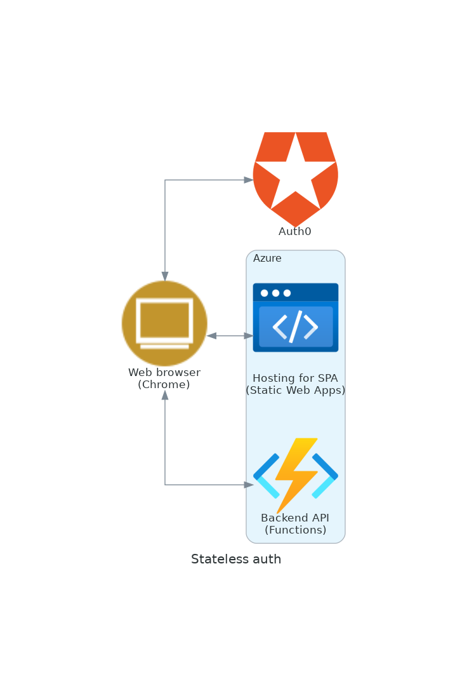
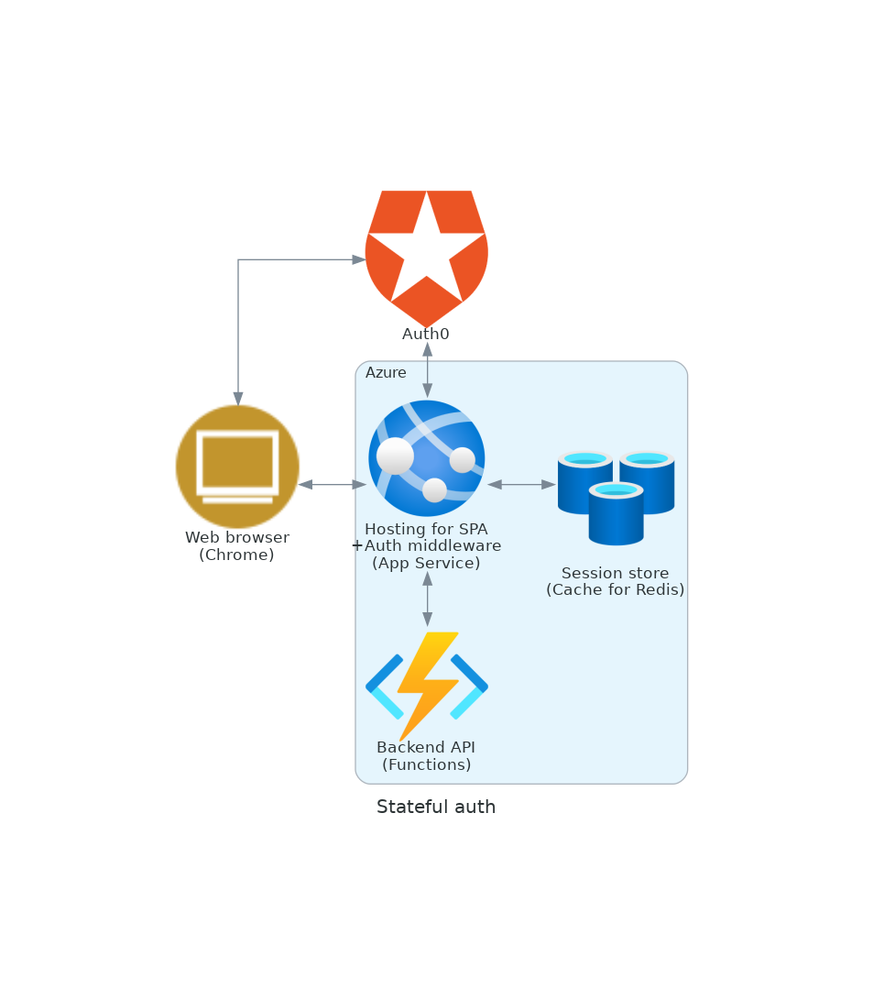

# Auth0 Azure SPA Sample

Sample code using Auth0 SDK with Azure

- controls authentication for a SPA served by Azure hosting service
- calls an authorization-controlled backend API deployed to Azure Functions
- is implemented two patterns: [stateless authentication](frontend/stateless) and [stateful authentication](frontend/stateful).

  
  

## Overview

### Stateless frontend

- is a single page application implemented using Vue
- uses [Authroization Code Flow with PKCE](https://auth0.com/docs/get-started/authentication-and-authorization-flow/authorization-code-flow-with-proof-key-for-code-exchange-pkce)
- uses [Auth0 Vue SDK](https://github.com/auth0/auth0-vue) for auth handling
- requires Auth0 configuration. Please refer to the following:
  - [Auth0 Vue SDK Quickstarts](https://auth0.com/docs/quickstart/spa/vuejs)

### Stateful frontend

- is a regular web application implemented using Express
- uses [Authroization Code Flow with PKCE](https://auth0.com/docs/get-started/authentication-and-authorization-flow/authorization-code-flow-with-proof-key-for-code-exchange-pkce)
- uses [Auth0 Express SDK](https://github.com/auth0/express-openid-connect) for auth handling
- serve static files for SPA
- requires Auth0 configuration. Please refer to the following:
  - [Auth0 Express SDK Quickstarts](https://auth0.com/docs/quickstart/webapp/express)

### Backend

- is implemented Azure Functions using Python
- is common for both stateless and stateful authentication patterns
- performs access token validation and role-based authorization control
- requires Auth0 configuration. Please refer to the following:
  - [Add Authorization to a Flask API application](https://auth0.com/docs/quickstart/backend/python/interactive)

> Note: [Authorization for HTTP triggers for Azure Functions](backend/utils/auth/functions_oauth2) was implemented based on [Authlib's API for flask](https://github.com/lepture/authlib/tree/v1.2.0/authlib/integrations/flask_oauth2)

## Azure resouces creation and deployment

- You can use [bash scripts](scripts)

> Note: Apart from the Azure environment, Auth0 configurations are also required
